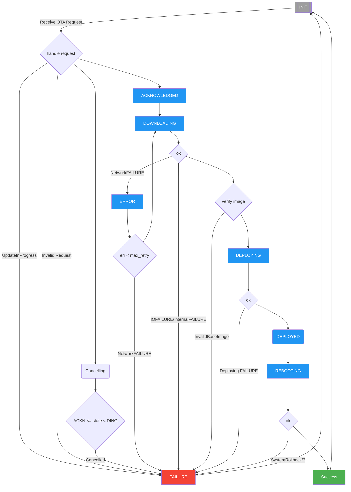

<!--
Copyright 2024 SECO Mind Srl

SPDX-License-Identifier: Apache-2.0
-->

# Over The Air (OTA) updates
Over-the-Air (OTA) Update is a method for delivering firmware updates to remote devices using a network connection.
Although the name implies a wireless connection, updates received over a wired connection (such as Ethernet) are still
commonly referred to as OTA updates.

## MCUboot
The device firmware upgrade is based on [MCUboot](https://docs.mcuboot.com/readme-zephyr.html), Zephyr is directly
compatible with the open source, cross-RTOS MCUboot boot loader.
It interfaces with MCUboot and is aware of the image format required by it, so that Device Firmware Upgrade is available when MCUboot
is the boot loader used with Zephyr, the binary is first downloaded into an unoccupied code partition,
usually named `slot1_partition`, then upgraded using the MCUboot process.

The first step required for Zephyr is making sure your board has flash partitions defined in its device tree.
These partitions are:

- `boot_partition`: for MCUboot itself
- `slot0_partition`: the primary slot of Image 0
- `slot1_partition`: the secondary slot of Image 0

A portion of the flash memory can be partitioned into multiple image areas, each contains two image slots, a primary slot and a secondary slot. Normally, the bootloader will only run an image from the primary slot, so images must be built such that they can run from that fixed location in flash. If the bootloader needs to run the image resident in the secondary slot, it must copy its contents into the primary slot by overwriting the contents of the primary slot.

Currently we use Mcuboot with `BOOT_UPGRADE_ONLY` enabled, this option overwrite the primary slot with the upgrade image instead of swapping them. This prevents the fallback recovery, but uses a much simpler code path.

## Signing the application
In order to upgrade to an image, images must be signed. To make development easier, MCUboot is distributed with some example keys.
It is important to stress that these should never be used for production, since the private key is publicly available in this repository.
See [Mcuboot-Signing application](https://docs.mcuboot.com/readme-zephyr.html) section on how to make your own signatures.

## OTA Procedure

OTA flowchart:

